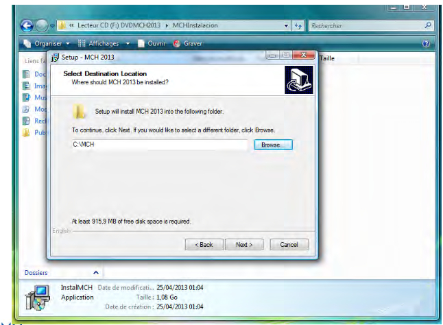
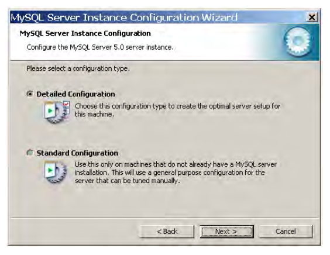
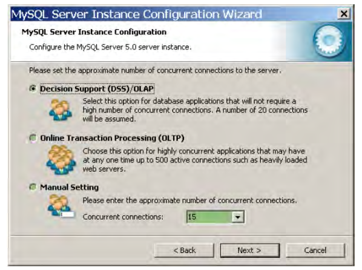

- # Installation in [[Windows]] Server
	- ## Steps:
		- ### Configuration of the computers & Installation environment
			- Login with full administrator rights
			- Check if your computer has a 32 or 64-bit processor
			- Create shortcuts to ODBC,services and control panel (This step is not necessary)
			- Set regional settings, decimals should be defined with dots (.)
			- Turn Wi-Fi off or disconnect the computer from internet
			- Turn Antivirus off
			- Disable Firewall
		- ### Installation of MCH
collapsed:: true
			- Open MCHInstalacion by running INstalMCH.exe
				- 
				- ==**Optional**== *Save in the root, to avoid long path* *No space in the name of the folder*
					- 
				- Select English for the language
				- ==**Optional**== *Rename the shortcut if needed*
					- 
				- Check that all parameters are good and Install
					- 
				- Finish Installation
					- 
		- ### Installation of Additional Software
			- ==**Note**== Check the ((626acb08-5cb7-4427-b86b-bd79eae6928f)) page to find links to the additional software.
			- Install [gostscript.ps –32 or 64 bits](https://u.pcloud.link/publink/show?code=XZuFQxkZkp2f2KkBFJX8HGfUwsrN2hiAKGBk).
collapsed:: true
				- ==Note== Leave default settings (install fonts ticked)
				- 
			- Install [RuntimePlus](https://u.pcloud.link/publink/show?code=XZOFQxkZChg6wHApJ57nMeVHNuiesJF1GsDX) (RunTimePlus /dBasePlusRuntimeEngine1703_EN.exe)
collapsed:: true
				- 
			- ==**Optional**== If needed edit the **gmtenv.bat** (C:/MCH/gmtenv.bat), needed for the map environment as follows:
collapsed:: true
				- 
			- Installation of MySQL Server 5
collapsed:: true
				- Download the right executable for a 32 or 64 bit system
				- Tick Configure MySQL Server now
					- 
				- Select Detailed Configuration
					- 
				- Select Server Machine
					- 
				- Select Non-Transactional Database
					- 
					- ==**Note**==: You can also select Multifunctional Database if you are already using a Transactional Database on your computer
				- Check installation path
					- 
				- Select number of users
					- 
				- Networking options
collapsed:: true
					- Enabling TCP/IP networking
						- 
							- 1. Tick Enable TCP/IP Networking
							  2. Select port 3306
							  3. Tick Add firewall exception
							  4. Untick Enable Strict Mode
					- Select Standard Character Set
						- 
					- Installing as a [[Windows]] service
						- 
							- 1. Tick Install as Windows Service
							  2. Select MySQL5
							  3. Tick Launch the MySQL server automatically
							  4. Tick include Bin
				- Set MySQL Admin password
					- Tick Modify Security Settings
					- Create a password ==**Save it**==
					- Tick Enable root access from remote machines
					- 
				- Execute
					- 
				- Finish
					- 
				- Check that the service is properly running
					- ==**Note**== **If it is not running check firewall exceptions**
				- Check that password is by running: **Programmes/MySQL/MySQL Server 5/MySQL Command Line Client**
					- 
			- Install MySQL Server 5 Tools
				- Execute: [mysql-gui-tools-5.0-r12-win32.msi](https://u.pcloud.link/publink/show?code=XZ2tQxkZeBdqRJxfKlh32j6YIeNCryjRFQX7)
					- 
				- Select the folder tools with in the folder where MySQL Server 5 has been installed
collapsed:: true
					- ==**Note**== If it does not exist create a new folder and rename it `«tools»`
					- 
					- 
				- Select Complete
					- 
				- Install
					- 
					-
				-
- # Ref Links:
  id:: 626acb08-5cb7-4427-b86b-bd79eae6928f
	- MCH Version 2018 Latest version of MCH: ==**The current link has expired**==
	- Free Pascal version of MCH: ==**The current link has expired**==
	- User Manual in English: [URL](https://u.pcloud.link/publink/show?code=XZ5GzCXZViEMavhNfG403rV1X4JrMmEFuQuk) 
	- User Manual in Spanish: [URL](https://u.pcloud.link/publink/show?code=XZlYePXZXaaDorE0MV77UpmtzFuzXfVOqiQX) 
	- Steps to install MCH and the additional software [URL](https://u.pcloud.link/publink/show?code=XZLmePXZ1RmEcsQ9mQVbSQCIrOzrU0h3tIp7) 
	- Additional Software needed to run MCH:
		- [Gostscript](https://u.pcloud.link/publink/show?code=XZuFQxkZkp2f2KkBFJX8HGfUwsrN2hiAKGBk)
		- [Runtime](https://u.pcloud.link/publink/show?code=XZOFQxkZChg6wHApJ57nMeVHNuiesJF1GsDX)
		- MySQL
			- [SetupMySQL5_0_51.exe](https://u.pcloud.link/publink/show?code=XZzpQxkZBtHTJr8EzvpLQQj0KsD428AIkWaV)
			- [Setupmysql-5.0.51b-winx64.exe](https://u.pcloud.link/publink/show?code=XZSpQxkZ3PH1Hltan7XnHcObDGpwNJ5Qrbqy)
		- [MySQL ODBC connectors different versions](https://u.pcloud.link/publink/show?code=kZzHQxkZxKSLxJGC36pVy6vxwT8f00UQPcUV)
		- [MySQL tools](https://u.pcloud.link/publink/show?code=XZ2tQxkZeBdqRJxfKlh32j6YIeNCryjRFQX7)
		- Databases:
			- [mcheng](https://u.pcloud.link/publink/show?code=XZnDHyXZu6bEol5aSbzyYkRgTjltoYLzFu1k)
			- [capttemp](https://u.pcloud.link/publink/show?code=XZbIQxkZF906UzMvrbjzSdcxb0R12XdhsIAX)
-