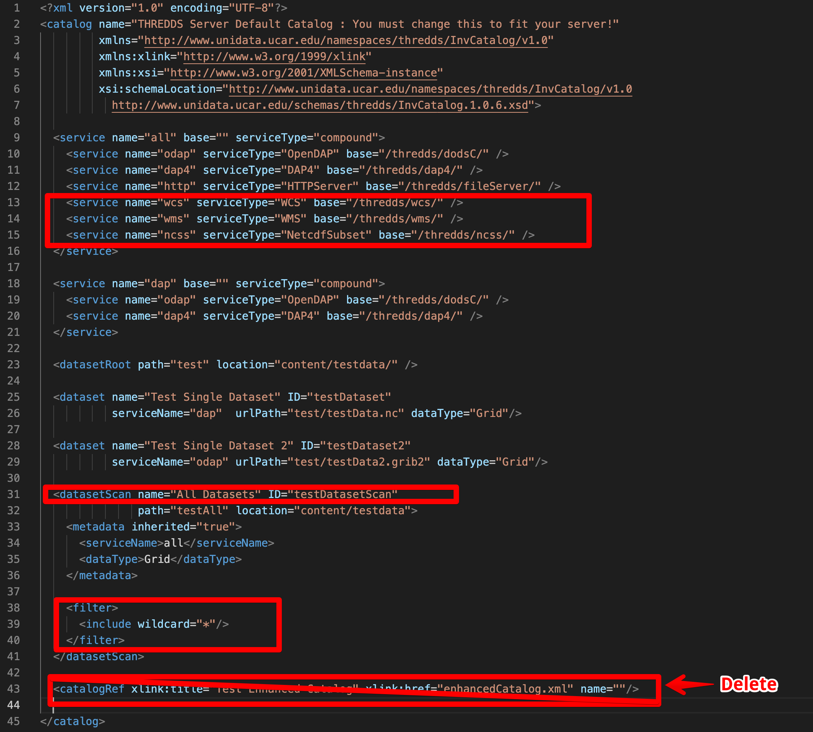
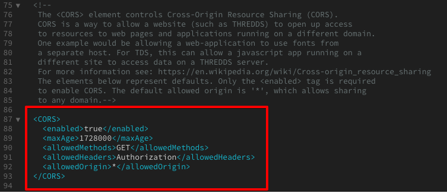
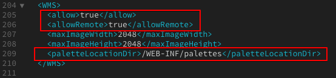

- Set up
	- Docker
		- Docker-compose
		- Configuration inside the container (this can be added in the dockerfile by just replacing the existing catalog.xml, threedsConfig.xml, wmsConfig.xml)
			- 1. docker exec -it <name_container> /bin/bash
			  2. [[VIM]] into catalog.xml (example below)
			  ``` xml
			  <?xml version="1.0" encoding="UTF-8"?>
			  <catalog name="SENAMHI THREDDS Server Catalog"
			           xmlns="http://www.unidata.ucar.edu/namespaces/thredds/InvCatalog/v1.0"
			           xmlns:xlink="http://www.w3.org/1999/xlink"
			           xmlns:xsi="http://www.w3.org/2001/XMLSchema-instance"
			           xsi:schemaLocation="http://www.unidata.ucar.edu/namespaces/thredds/InvCatalog/v1.0
			             http://www.unidata.ucar.edu/schemas/thredds/InvCatalog.1.0.6.xsd">
			  
			    <service name="all" base="" serviceType="compound">
			      <service name="odap" serviceType="OpenDAP" base="/thredds/dodsC/" />
			      <service name="dap4" serviceType="DAP4" base="/thredds/dap4/" />
			      <service name="http" serviceType="HTTPServer" base="/thredds/fileServer/" />
			      <service name="wcs" serviceType="WCS" base="/thredds/wcs/" />
			      <service name="wms" serviceType="WMS" base="/thredds/wms/" />
			      <service name="ncss" serviceType="NetcdfSubset" base="/thredds/ncss/" />
			    </service>
			  
			    <service name="dap" base="" serviceType="compound">
			      <service name="odap" serviceType="OpenDAP" base="/thredds/dodsC/" />
			      <service name="dap4" serviceType="DAP4" base="/thredds/dap4/" />
			    </service>
			  
			    <datasetRoot path="test" location="content/" />
			  
			    <datasetScan name="data" ID="testDatasetScan"
			                 path="thredds_data" location="content/">
			      <metadata inherited="true">
			        <serviceName>all</serviceName>
			        <dataType>Grid</dataType>
			      </metadata>
			  
			      <filter>
			        <include wildcard="*.nc"/>
			        <include wildcard="*.nc4"/>
			        <include wildcard="*"/>
			      </filter>
			    </datasetScan>
			  
			  </catalog>
			  ```
			  You can also check the following image
			  
			   
			  
			  3. [[VIM]] into the “threddsConfig.xml” file
			  Uncomment the CORS tag and enable it to “true”
			  
			  Uncomment the WMS section and set “allow” and “allowRemote” to true, Also, add in this line of code:
			  ```xml
			  <paletteLocationDir>/WEB-INF/palettes</paletteLocationDir>
			  ```
			  
			  
			  4. `docker restart <container>`
				-
				-
			- - Uncomment the WMS section and set “allow” and “allowRemote” to true, 
			      Also, add in this line of code:
			-
-